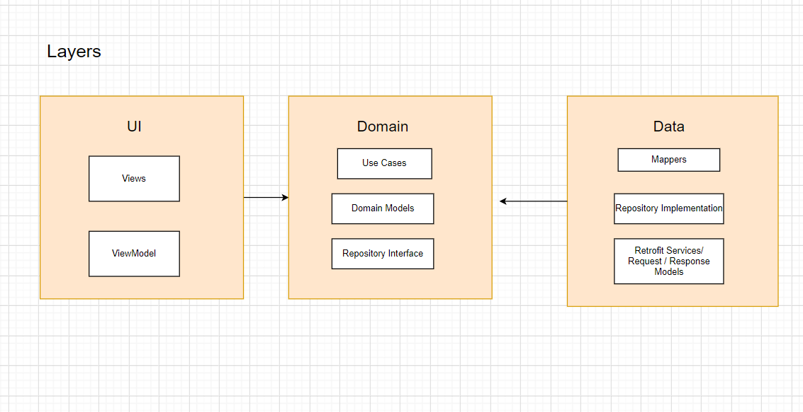

# About StarWars App
Hello there ,
In this project I tried showcasing how to build an Android Application with clean architecture and MVVM using some of the jetpack libraries with Kotlin Coroutines & Dagger2. This App is using the [Star Wars API](https://swapi.dev/) as a remote data source.

This side Project was initially a case study given to me as a challenge for an android role.

I wrote an [article](https://medium.com/@hamdiboumaiza/navigating-mvvm-with-dagger-2-coroutines-and-aac-57a37ac25f3a) a while back in which i talked about some the choices i take when developing an android application.

This app is based on the [Guide to app architecture](https://developer.android.com/jetpack/docs/guide) article, [Kotlin 1.4](https://kotlinlang.org/docs/reference/whatsnew13.html), and [coroutine](https://kotlinlang.org/docs/reference/coroutines/basics.html). I also used some android architecture components like [LiveData](https://developer.android.com/jetpack/arch/livedata), [ViewModel](https://developer.android.com/topic/libraries/architecture/viewmodel).

# Screenshots
<p align="center">
  
  
  
</p>

# Project Architecture
### Communication between layers
1. UI calls method from ViewModel.
2. ViewModel executes Use case.
3. Use case executes one or multiple Repositorie function.
4. The Repository returns data from one or multiple Data Sources. the repository is the single source of truth
5. Information flows back to the UI where we display the data fetched from data sources.

I made a diagram to show the flow of the data between the three layers(data, domain , presentation)

# Project Structure
* Data
    * This is my data layer and consisted of the Room Database associated classes, the Network
    related classes including the CoinsService interface, and the Repository class as well as
    the local and remote data sources
* Domain
    * This is the domain layer and consists of the domain model as well as the domain mapper
* UI
    * This is the presentation layer. I have set up packages by feature here. This consists of the view related code.
* DI
    * This is where Dagger related code lives ,connected to the different layers of the application
* Utils
    * This is where most extension functions and constants and some other utils functions exist.

Libraries Used
---------------
* [ViewModel](https://developer.android.com/topic/libraries/architecture/viewmodel) - store and manage UI-related data in a lifecycle conscious way
* [StateFlow](https://developer.android.com/kotlin/flow/stateflow-and-sharedflow) - enable flows to optimally emit state updates and emit values to multiple consumers..
* [ViewBinding](https://developer.android.com/topic/libraries/view-binding) - bind UI components to data sources
* [Material](https://material.io/develop/android/docs/getting-started/) - Material Components.
* [Coroutine](https://github.com/Kotlin/kotlinx.coroutines#user-content-android) - performs background tasks
* [Flows](https://kotlin.github.io/kotlinx.coroutines/kotlinx-coroutines-core/kotlinx.coroutines.flow/-flow/) - for asynchronous data streams
* [Retrofit2](https://square.github.io/retrofit/)- networking
* [Gson](https://github.com/google/gson) - JSON Parser
* [Dagger2](https://dagger.dev/users-guide) - dependency injector
* [Stetho](http://facebook.github.io/stetho/) - debug bridge
* [Espresso](https://developer.android.com/training/testing/espresso/) // UI test
* [Barsita](https://github.com/AdevintaSpain/Barista) -UI tests Built on top of Espresso
* [Junit](https://junit.org/junit4/) // unit tests
* [Truth](https://github.com/google/truth) // Makes your test assertions and failure messages more readable


# To be added
* more testing
* animations

<br />

## License 🔖
```
    Apache 2.0 License


    Copyright 2021 Hamdi Boumaiza

    Licensed under the Apache License, Version 2.0 (the "License");
    you may not use this file except in compliance with the License.
    You may obtain a copy of the License at

       http://www.apache.org/licenses/LICENSE-2.0

    Unless required by applicable law or agreed to in writing, software
    distributed under the License is distributed on an "AS IS" BASIS,
    WITHOUT WARRANTIES OR CONDITIONS OF ANY KIND, either express or implied.
    See the License for the specific language governing permissions and
    limitations under the License.

```

